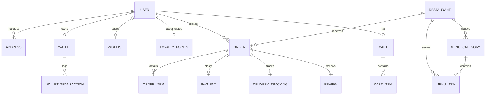

# CraveGo Database Design & Schema Architecture

This document describes the database design, entity relationships, indexing strategies, and scalability optimizations for **CraveGo**.

---

## 📊 Entity-Relationship (ER) Diagram

The following Mermaid diagram outlines the relational flow between core collections.

---

## 🔍 MongoDB Indexing Strategy

To support fast lookups, low query execution latency, and high concurrent loads, we implement specialized index types:

1. **Unique Indexes:**
   - `User.email` & `User.phone` (Fast authentication lookup)
   - `Coupon.code` (Case-insensitive unique promo lookups)
   - `SupportTicket.ticketNumber` & `Order.orderNumber` (Unique alphanumeric references)

2. **Compound Indexes:**
   - `MenuItem.restaurant_1_category_1` (Speeds up loading a restaurant menu filtered by courses)
   - `CartItem.cart_1_menuItem_1` (Fast incrementing of quantity in checkout operations)
   - `Notification.user_1_isRead_1_createdAt_-1` (Enables listing unread notifications chronologically)

3. **Geospatial Indexes (`2dsphere`):**
   - `Restaurant.location` (Finds nearby restaurants based on client GPS coords using `$near` or `$geoWithin`)
   - `Address.location` (Saves customer coordinates to measure exact road route distance)
   - `DeliveryPartner.currentLocation` (Enables real-time tracking query of available drivers nearby)

4. **Text Indexes:**
   - `MenuItem.name_text_description_text` (Supports quick fuzzy search for foods and dishes)

5. **TTL Indexes:**
   - `OTP.expiresAt` (Self-deletes OTP documents after 10 minutes)
   - `RefreshToken.expiresAt` (Self-wipes expired session rotation tokens)

---

## 📈 Performance & Scalability Recommendations

1. **Denormalization vs. Referencing:**
   - Customer addresses are stored in a separate `Address` collection to prevent the `User` document size from growing indefinitely (MongoDB's maximum document size is 16MB).
   - Order items are isolated in `OrderItem` to keep the parent `Order` timeline array query-performant.
   
2. **Aggregations for Ratings:**
   - We utilize an aggregate pre-save/post-delete hook on `Review` to dynamically calculate `averageRating` and `totalReviews` and save them on the parent `Restaurant` model. This eliminates costly runtime calculations on restaurant list rendering.

3. **Soft Deletion Filtering:**
   - High-throughput collections (`User`, `Restaurant`, `MenuItem`) implement query middlewares (`pre(/^find/)`) to automatically ignore rows marked with `isDeleted: true`.

4. **Read Prefers & Sharding:**
   - Read operations can be directed to secondary replica sets (`ReadPreference = secondaryPreferred`) since food menus change less frequently than orders.
   - Scale-out sharding keys should use hashed user/restaurant IDs (e.g. `customer` on Orders) to ensure uniform data partition.
