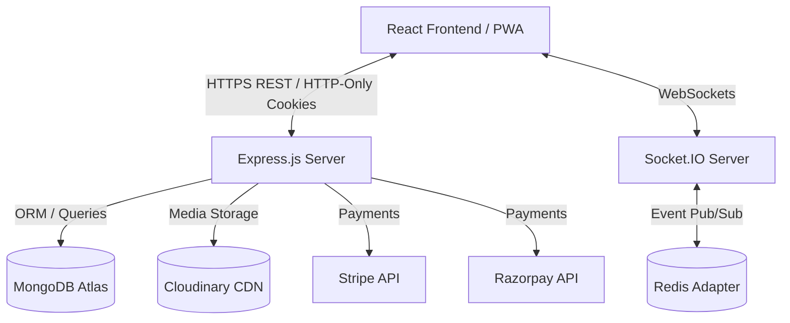
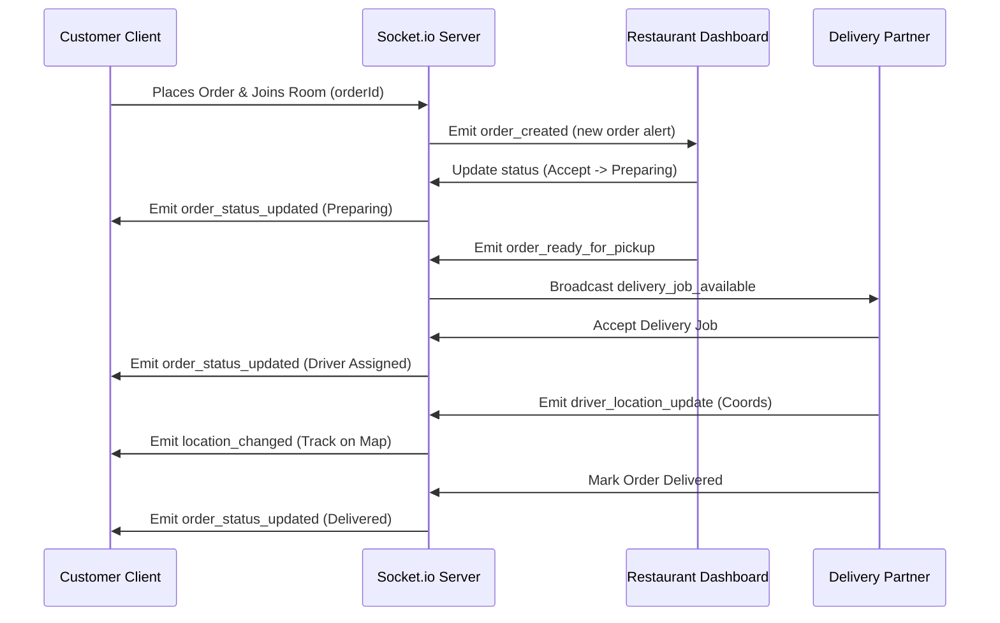

# FoodHub System Design

This document details the high-level architecture, flow systems, and database relationships of FoodHub.

---

## 🏛️ System Architecture

FoodHub is designed as a decoupled multi-tier web application to ensure high scalability, isolation, and service maintainability.

---

## 🔑 Key Workflows

### 1. Verification & Security Flow
- Passwords hashed using `bcrypt` (12 rounds) inside schema hooks.
- JWT Access token issued with 15-minute expiration; stored in React memory or state.
- JWT Refresh token stored in secure, `httpOnly`, `sameSite=strict` cookies; 7-day expiration.
- Cross-Site Scripting (XSS) prevention handled via Helmet security headers and strict input sanitization.

### 2. Live Order Tracking Flow

